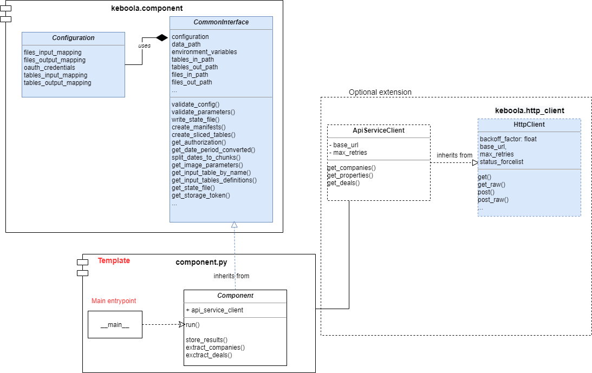
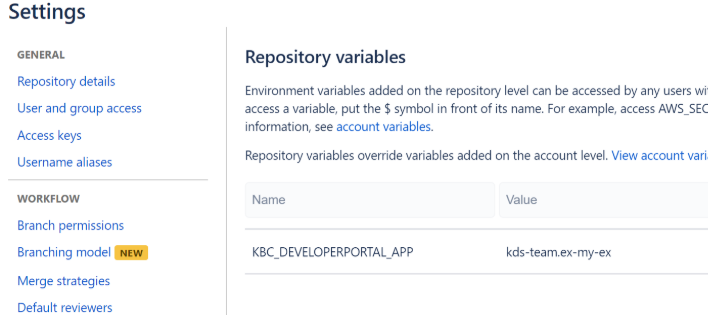

# KBC Component Python template

Python template for KBC Component creation. Defines the default structure and all Bitbucket pipeline CI scripts for automatic deployment.

Use as a starting point when creating a new component.

Example uses [keboola.component](https://pypi.org/project/keboola.component) library providing useful methods for KBC related tasks 
and boilerplate methods often needed by components, for more details see [documentation](https://github.com/keboola/python-component/blob/main/README.md)

*NOTE: Previously the template was based on top of the deprecated [keboola-python-util-lib library](https://bitbucket.org/kds_consulting_team/keboola-python-util-lib/src/master/)*

**Table of contents:**  
  
[TOC]

# Recommended component architecture
It is recommended to use the [keboola.component library](https://pypi.org/project/keboola.component), 
for each component. Major advantage is that it reduces the boilerplate code replication, the developer can focus on core component logic 
and not on boilerplate tasks. If anything is missing in the library, please fork and create a pull request with additional changes, 
so we can all benefit from it

**Base components on [CommonInterface](https://htmlpreview.github.io/?https://raw.githubusercontent.com/keboola/python-component/main/docs/api-html/component/interface.html#keboola.component.interface.CommonInterface)**

- No need to write configuration processing and validation code each time
- No need to setup logging environment manually
- No need to write code to store manifests, write statefile, retrieve dates based on relative period, and many more.
- The main focus can be the core component logic, which increases the code readability for new comers.

**Base Client on [HtttpClient](https://pypi.org/project/keboola.http-client/)**

- No need to write HTTP request handling over and over again
- Covers basic authentication, retry strategy, headers, default parameters


## Architecture using the template



## Example component
This template contains functional example of an [hello-world component](https://bitbucket.org/kds_consulting_team/kbc-python-template/src/master/src/component.py), 
it can be run with [sample configuration](https://bitbucket.org/kds_consulting_team/kbc-python-template/src/master/data/) and it produces valid results. 
It is advisable to use this structure as a base for new components. Especially the `component.py` module, which should only 
contain the base logic necessary for communication with KBC interface, processing parameters, collecting results
 and calling targeted API service methods. 


# Creating a new component
Clone this repository into new folder and remove git history
```bash
git clone https://bitbucket.org/kds_consulting_team/kbc-python-template.git my-new-component
cd my-new-component
rm -rf .git
git init
git remote add origin PATH_TO_YOUR_BB_REPO
git add .
git commit -m 'initial'
git push -u origin master
```

**Method #2:**

Copy the contents of the template folder into your clone empty repository

```bash
git clone PATH_TO_YOUR_BB_REPO my-new-component
# now copy the contents of the template into the my-new-component dir
cd my-new-component
git add .
git commit -m 'initial'
git push -u origin master
```

# Setting up the CI
 - Bitbucket: Enable [pipelines](https://confluence.atlassian.com/bitbucket/get-started-with-bitbucket-pipelines-792298921.html) in the repository.
    - For Github: Check that the [workflows are enabled](https://docs.github.com/en/actions/managing-workflow-runs/disabling-and-enabling-a-workflow).
    The actions are present in `.github/workflows/` folder. 
 - Set `KBC_DEVELOPERPORTAL_APP` env variable (dev portal app id)
 
 In case it is not set on the account level, set also other required dev portal env variables:
 
 - `KBC_DEVELOPERPORTAL_PASSWORD` - service account password
 - `KBC_DEVELOPERPORTAL_USERNAME` - service account username
 - `KBC_DEVELOPERPORTAL_VENDOR` - dev portal vendor
 - `KBC_STORAGE_TOKEN` - (optional) in case you wish to run KBC automated tests
  
 
 
 
The script execution is defined in three stages:

## Default stage
This script is executed on push to any branch except the master branch. It executes basic build and code quality steps. Following steps are performed:
Build docker image
Execute flake8 lint tests
Execute python unittest
(Optional) Push image with tag :test into the AWS repository for manual testing in KBC
If any of the above steps results in non 0 status, the build will fail. It is impossible to merge branches that fail to build into the master branch.

## Master stage
This script is executed on any push or change in the master branch. It performs every step as the default stage. Additionally, 
the `./scripts/update_dev_portal_properties.sh` script is executed. 
This script propagates all changes in the Component configuration files (component_config folder) to the Developer portal.
Currently these Dev Portal configuration parameters are supported:

 - `configSchema.json`
 - `configRowSchema.json`
 - `component_short_description.md`
 - `component_long_description.md`    

The choice to include this script directly in the master branch was made to simplify ad-hoc changes of the component configuration parameters. For instance if you wish to slightly modify the configuration schema without affecting the code itself, it is possible to simply push the changes directly into the master and these will be automatically propagated to the production without rebuilding the image itself. Solely Developer Portal configuration metadata is deployed at this stage.

## Tagged commit stage
Whenever a tagged commit is added, or tag created this script gets executed. This is a deployment phase, so a successful build results in new code being deployed in KBC production.
At this stage all steps present in the default and master stage are executed. Additionally, 
`deploy.sh` script that pushes the newly built image / tag into the ECR repository and KBC production is executed.
The deploy script is executed only after all tests and proper build steps passed. 
Moreover, the `deploy.sh` script will be executed **only in the master branch**. In other words if you create a tagged commit in another branch, the pipeline gets triggered but deployment script will fail, because it is not triggered within a master branch. This is to prevent accidental deployment from a feature branch.

 
# GELF logging

The template automatically chooses between STDOUT and GELF logger based on the Developer Portal configuration.

To fully leverage the benefits such as outputting the `Stack Trace` into the log event detail (available by clicking on the log event) 
log exceptions using `logger.exception(ex)`.

**TIP:** When the logger verbosity is set to `verbose` you may leverage `extra` fields to log the detailed message in the detail of the log event by adding extra fields to you messages:

```python
logging.error(f'{error}. See log detail for full query. ',
                         extra={"failed_query": json.dumps(query)})
```

Recommended [GELF logger setup](https://developers.keboola.com/extend/common-interface/logging/#setting-up) (Developer Portal) to allow debug mode logging:

```json
{
  "verbosity": {
    "100": "normal",
    "200": "normal",
    "250": "normal",
    "300": "verbose",
    "400": "verbose",
    "500": "camouflage",
    "550": "camouflage",
    "600": "camouflage"
  },
  "gelf_server_type": "tcp"
}
``` 
 
# Development
 
This example contains runnable container with simple unittest. For local testing it is useful to include `data` folder in the root
and use docker-compose commands to run the container or execute tests. 

If required, change local data folder (the `CUSTOM_FOLDER` placeholder) path to your custom path:
```yaml
    volumes:
      - ./:/code
      - ./CUSTOM_FOLDER:/data
```

Clone this repository, init the workspace and run the component with following command:

```
git clone https://bitbucket.org:kds_consulting_team/kbc-python-template.git my-new-component
cd my-new-component
docker-compose build
docker-compose run --rm dev
```

Run the test suite and lint check using this command:

```
docker-compose run --rm test
```

## Testing

The preset pipeline scripts contain sections allowing pushing testing image into the ECR repository and automatic 
testing in a dedicated project. These sections are by default commented out. 

**Running KBC tests on deploy step, before deployment**

Uncomment following section in the deployment step in `bitbucket-pipelines.yml` file:

```yaml
            # push test image to ECR - uncomment when initialised
            # - export REPOSITORY=`docker run --rm -e KBC_DEVELOPERPORTAL_USERNAME -e KBC_DEVELOPERPORTAL_PASSWORD -e KBC_DEVELOPERPORTAL_URL quay.io/keboola/developer-portal-cli-v2:latest ecr:get-repository $KBC_DEVELOPERPORTAL_VENDOR $KBC_DEVELOPERPORTAL_APP`
            # - docker tag $APP_IMAGE:latest $REPOSITORY:test
            # - eval $(docker run --rm -e KBC_DEVELOPERPORTAL_USERNAME -e KBC_DEVELOPERPORTAL_PASSWORD -e KBC_DEVELOPERPORTAL_URL quay.io/keboola/developer-portal-cli-v2:latest ecr:get-login $KBC_DEVELOPERPORTAL_VENDOR $KBC_DEVELOPERPORTAL_APP)
            # - docker push $REPOSITORY:test
            # - docker run --rm -e KBC_STORAGE_TOKEN quay.io/keboola/syrup-cli:latest run-job $KBC_DEVELOPERPORTAL_APP BASE_KBC_CONFIG test
            # - docker run --rm -e KBC_STORAGE_TOKEN quay.io/keboola/syrup-cli:latest run-job $KBC_DEVELOPERPORTAL_APP KBC_CONFIG_1 test
            - ./scripts/update_dev_portal_properties.sh
            - ./deploy.sh
```

Make sure that you have `KBC_STORAGE_TOKEN` env. variable set, containing appropriate storage token with access 
to your KBC project. Also make sure to create a functional testing configuration and replace the `BASE_KBC_CONFIG` placeholder with its id.

**Pushing testing image for manual KBC tests**

In some cases you may wish to execute a testing version of your component manually prior to publishing. For instance to test various
configurations on it. For that it may be convenient to push the `test` image on every push either to master, or any branch.

To achieve that simply uncomment appropriate sections in `bitbucket-pipelines.yml` file, either in master branch step or in `default` step.

```yaml
            # push test image to ecr - uncomment for testing before deployment
#            - echo 'Pushing test image to repo. [tag=test]'
#            - export REPOSITORY=`docker run --rm -e KBC_DEVELOPERPORTAL_USERNAME -e KBC_DEVELOPERPORTAL_PASSWORD -e KBC_DEVELOPERPORTAL_URL quay.io/keboola/developer-portal-cli-v2:latest ecr:get-repository $KBC_DEVELOPERPORTAL_VENDOR $KBC_DEVELOPERPORTAL_APP`
#            - docker tag $APP_IMAGE:latest $REPOSITORY:test
#            - eval $(docker run --rm -e KBC_DEVELOPERPORTAL_USERNAME -e KBC_DEVELOPERPORTAL_PASSWORD -e KBC_DEVELOPERPORTAL_URL quay.io/keboola/developer-portal-cli-v2:latest ecr:get-login $KBC_DEVELOPERPORTAL_VENDOR $KBC_DEVELOPERPORTAL_APP)
#            - docker push $REPOSITORY:test
```
 
 Once the build is finished, you may run such configuration in any KBC project as many times as you want by using [run-job](https://kebooladocker.docs.apiary.io/#reference/run/create-a-job-with-image/run-job) API call, using the `test` image tag.

# Integration

For information about deployment and integration with KBC, please refer to the [deployment section of developers documentation](https://developers.keboola.com/extend/component/deployment/) 